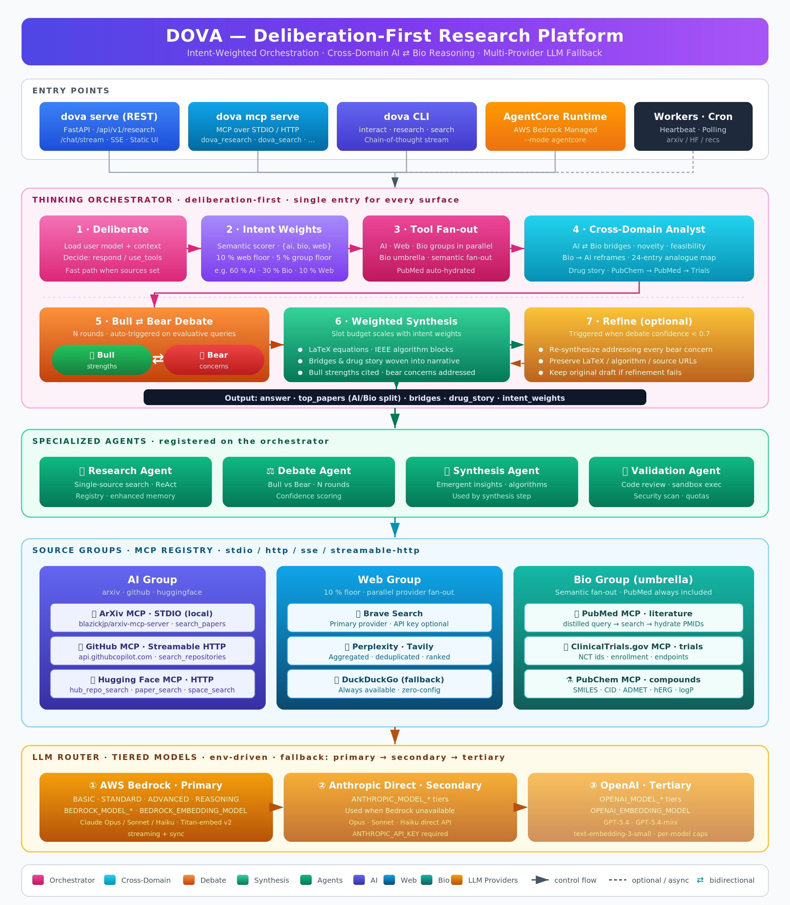

# DOVA - Deep Orchestrated Versatile Agent Platform

DOVA is an enterprise-grade, multi-agent research automation system built on AWS Strands Agents SDK and Amazon Bedrock AgentCore. It aggregates knowledge from ArXiv, GitHub, HuggingFace, biomedical sources (PubMed / ClinicalTrials.gov / PubChem), and the web through the Model Context Protocol (MCP).

**Latest: v2.1** — **Concurrency & observability release.** Removes five compounding bottlenecks that caused `dova mcp serve` to time out under ~9 parallel requests: serialized cold start under `asyncio.Lock`, 64-thread default executor (env-tunable via `DOVA_EXECUTOR_WORKERS`), pooled `httpx.AsyncClient` with per-server session-init locks, transport-aware retries (STDIO keeps 3, HTTP drops to 1 — saves ~50 s per failed call), plus in-flight request gauge (`request_started` / `request_finished`) and executor saturation logger (`executor_saturation` every 5 s while busy). No API or schema changes. See [release notes](docs/release_notes_v2.1.md). Prior: [v2.0](docs/release_notes_v2.0.md), [v1.9](docs/release_notes_v1.9.md), [v1.8](docs/release_notes_v1.8.md), [v1.7](docs/release_notes_v1.7.md).

## Features

### Core Capabilities
- **Concurrency-Safe Serving** *(New in v2.1)*: `dova mcp serve` and `dova serve` no longer serialize or time out under parallel load. Cold-start `_get_services` is lock-protected; the default `ThreadPoolExecutor` is enlarged to **64 threads** (tunable via `DOVA_EXECUTOR_WORKERS`) so synchronous boto3 Bedrock calls don't queue; `httpx.AsyncClient` is pooled per MCP client with per-server session-init locks; HTTP/SSE/streamable MCP retries drop from 3 to 1 (saves up to ~50 s per failing call). Every request emits `request_started` / `request_finished` structured logs with `in_flight` and `peak` counts, and an `executor_saturation` logger runs every 5 s while busy — giving operators real data on whether tuning matches traffic.
- **Intent-Weighted Paper Fan-out** *(Since v2.0)*: `master_paper_mcp` shard `limit` is now split across active umbrellas proportional to `deliberation.intent_weights`, with a floor of 1 per active umbrella. A query scored `{ai: 0.7, bio: 0.2, web: 0.1}` with `limit=10` now allocates `{ai: 7, bio: 2, web: 1}` shard capacity instead of a uniform 10 everywhere. Low-weight umbrellas stop burning downstream MCP capacity on results synthesis would trim.
- **DOI / Cross-Database Paper Verification** *(Since v1.9)*: `doi-bio` MCP server (tfscharff/doi-mcp, STDIO, zero-config via `npx`) exposes `findVerifiedPapers` across 9 academic DBs (CrossRef, OpenAlex, PubMed, Semantic Scholar, DBLP, zbMATH, ERIC, HAL, INSPIRE-HEP) and `verifyCitation` as an anti-hallucination check. `search_bio_tool` gains `verified_papers` / `citation` domains, and the bio router adds keyword-based semantic routing (e.g. `doi`, `crossref`, `openalex`, `verify citation`).
- **`master_paper_mcp` Gateway Fan-out** *(Since v1.9)*: Additive paper-search gateway registered via `~/.dova.json`. The orchestrator fans `search_papers` out over umbrella-specific subjects (`ai` → ai/computer/math/physics; `bio` → bio/clinical/chemistry; `web` → social/other) in parallel with the existing tools. Health-cached (30 s TTL), silently skipped when unavailable, never raises — stays best-effort.
- **Cross-Domain AI ⇄ Bio Analyst** *(New in v1.8)*: After tool fan-out, a dedicated bridge step emits structured `{ai_method, bio_target, mechanism, novelty, feasibility, testable_prediction}` pairs that are rendered in the synthesis narrative and surfaced as a 🔗 card in the UI. Gated — pure-AI and pure-bio queries skip it entirely.
- **Bio → AI Reframe Map** *(New in v1.8)*: 24 curated mechanism analogues (olfactory → sparse distributed reps, immune → clonal selection, hippocampus → episodic memory, …) injected into the synthesis prompt when biological vocabulary meets `ai_weight ≥ 0.3`. Zero LLM cost.
- **Drug-Story Chain** *(New in v1.8)*: PubChem + PubMed + ClinicalTrials payloads stitched into one structured `{compound, cid, mechanism_pmids, trial_ncts}` unit, rendered as a 💊 card with clickable links.
- **Bio-Flow Reliability** *(New in v1.8)*: PubMed is now always part of the bio fan-out (literature is nearly always relevant); raw natural-language queries are distilled before hitting NCBI (0 hits → 455+ hits in observed cases); PubMed responses are hydrated via `pubmed_fetch_articles` so synthesis has real titles/abstracts, not just PMIDs.
- **`dova mcp serve` Parity** *(New in v1.8)*: MCP tool server now runs the same `ThinkingOrchestrator` + memory + source registry as `dova serve`. `dova_research` returns `top_papers`, `pubmed_papers`, `cross_domain_bridges`, and `drug_story` identical to `/api/v1/research`.
- **100 % Env-Driven LLM Config** *(New in v1.8)*: No model IDs, embedding IDs, or provider priorities remain hardcoded. Edit `.env` to set primary / secondary / tertiary providers, per-tier models, embeddings, and output caps.
- **Weighted Intent Deliberation** *(Since v1.7)*: Every query is scored across {AI, Bio, Web} into a percentage distribution (e.g. `60% AI / 30% Bio / 10% Web`). Weights drive result aggregation in synthesis without zero-summing any group — a 10% web floor guarantees general-purpose context on every query.
- **Biotech / Pharma Sources** *(New in v1.6→1.7)*: `bio` umbrella routes to hosted PubMed, ClinicalTrials.gov, and PubChem MCP endpoints; orchestrator performs semantic multi-server fan-out based on keywords (literature / trials / compounds).
- **ThinkingOrchestrator** *(Since v1.5)*: Deliberation-first orchestration that reasons about user needs before deciding which tools to use; shared by `dova interact`, `dova research`, and the `dova serve` chat endpoints.
- **Interactive CLI Mode**: Claude Code-like experience with `dova interact` - chain-of-thought reasoning, memory integration, and automatic tool selection
- **Browser-Based Research UI**: Modern dark-theme interface at `http://localhost:8081/`
- **Multi-Agent Architecture**: Specialized agents for research, profiling, validation, synthesis, and debate
- **Agentic Reasoning**: ReAct-style reasoning loops, self-reflection, and working memory for smarter agents
- **Collaborative Intelligence**: Blackboard, ensemble, iterative refinement, and tool-augmented patterns for synergistic multi-agent reasoning (1+1>2)
- **Proactive Tool Discovery**: Automatic task analysis and tool selection from MCP servers, sandbox, and internal services
- **MCP Integration**: Unified protocol for ArXiv, GitHub, HuggingFace, web search, and biomedical sources (PubMed, ClinicalTrials.gov, PubChem — via the `bio` source with keyword-based semantic fan-out to the best server)
- **Multi-Provider Web Search**: Brave, Perplexity, Tavily, and DuckDuckGo with auto-selection and fallback
- **Grouped Source Selector** *(v1.7)*: Three top-level groups — **AI** (ArXiv + GitHub + HuggingFace), **Web**, **Bio** (PubMed + ClinicalTrials.gov + PubChem). Ticking a group expands to the concrete sources at request time.
- **Intelligent Source Selection**: Automatic source filtering based on query type (news vs technical)
- **Multi-Provider LLM**: AWS Bedrock, Anthropic, OpenAI with automatic fallback
- **Model Tiering**: Cost-optimized model selection (Basic/Standard/Advanced/Reasoning)

### Deep Research Intelligence (v1.3)
- **Answer Synthesis**: Direct LLM-synthesized answers to research queries (not just links)
- **Query Type Classification**: Automatic detection (technical, biographical, factual, general)
- **Smart Source Routing**: Biographical queries → web only; Technical queries → all sources
- **Confidence Scoring**: Answer quality assessment with 0-100% confidence scores
- **Iterative Query Refinement**: Automatic query improvement when confidence is low
- **Memory-Assisted Research**: Short-term (24h) and long-term (persistent) research memory

### Advanced Agent Intelligence (OpenClaw-Inspired)
- **Multi-Tiered Thinking**: Configurable thinking budgets (OFF→MINIMAL→LOW→MEDIUM→HIGH→XHIGH) with auto-selection based on task complexity
- **Self-Evaluation**: Response quality assessment with confidence scoring, format validation, and relevance checking
- **Intelligent Error Recovery**: Automatic error diagnosis (transient/configuration/capability) with recommended recovery actions
- **Session Management**: Automatic session freshness evaluation with staleness detection and recovery actions (continue/refresh/fork/repair)
- **Enhanced Memory**: Semantic search with MMR (Maximal Marginal Relevance) reranking for diverse, relevant results
- **Auto-Discovery**: Runtime discovery of available models and MCP servers with capability caching
- **Proactive Heartbeat**: Cron-based background tasks for health checks, cleanups, and periodic maintenance

### User & Content Features
- **Custom Sources**: User-defined research sources (Web URLs, RSS feeds, APIs) with quality learning
- **Proactive Recommendations**: Background monitoring of ArXiv/HuggingFace with personalized content delivery
- **User Profiling**: Personalized research recommendations with AgentCore Memory
- **Sandbox Execution**: Docker-based isolated code execution with resource tiers and quota management
- **Code Validation**: Static analysis and sandbox execution for validating research implementations
- **Bull/Bear Debate**: Balanced analysis through adversarial agent discussions
- **Background Jobs**: Redis Streams-based job queue with APScheduler for periodic tasks

## Quick Start

### Prerequisites

- Python 3.11+
- AWS Account with Bedrock access
- Docker (optional, for local development)

### Installation

```bash
# Clone the repository
git clone https://github.com/alfredcs/dova.git
cd dova

# Create virtual environment
python -m venv .venv
source .venv/bin/activate

# Install dependencies
pip install -e ".[dev]"

# Copy environment file
cp .env.example .env
# Edit .env with your configuration
```

### Configuration

Edit `.env` with your credentials. All LLM configuration is env-driven as of v1.8 — see `.env.example` for the full template:

```bash
# AWS Configuration
AWS_REGION=us-east-1

# Provider fallback order — primary first
LLM_PROVIDER_ORDER=bedrock,anthropic,openai

# Bedrock (primary) — tiered models
BEDROCK_MODEL_BASIC=us.anthropic.claude-haiku-4-5-20251001-v1:0
BEDROCK_MODEL_STANDARD=us.anthropic.claude-sonnet-4-20250514-v1:0
BEDROCK_MODEL_ADVANCED=us.anthropic.claude-opus-4-5-20251101-v1:0
BEDROCK_MODEL_REASONING=us.anthropic.claude-opus-4-5-20251101-v1:0
BEDROCK_EMBEDDING_MODEL=amazon.titan-embed-text-v2:0

# Anthropic (secondary fallback)
ANTHROPIC_API_KEY=your-anthropic-key
ANTHROPIC_MODEL_STANDARD=claude-sonnet-4-20250514
ANTHROPIC_MODEL_ADVANCED=claude-opus-4-5-20251101

# OpenAI (tertiary fallback)
OPENAI_API_KEY=your-openai-key
OPENAI_MODEL_STANDARD=gpt-5.4
OPENAI_EMBEDDING_MODEL=text-embedding-3-small

# MCP Server Configuration
MCP_GITHUB_TOKEN=ghp_xxxxxxxxxxxx

# Web Search Providers (optional — DuckDuckGo is free fallback)
BRAVE_API_KEY=xxx           # https://brave.com/search/api/
PERPLEXITY_API_KEY=xxx      # https://perplexity.ai/settings/api
TAVILY_API_KEY=xxx          # https://tavily.com
```

### Running Locally

```bash
# Start Redis (required for caching)
docker-compose up -d redis

# Run the API server
make run-local

# Or use Docker Compose for everything
docker-compose up -d
```

#### Concurrency tuning

Both `dova serve` and `dova mcp serve` share a single asyncio event loop with
a `ThreadPoolExecutor` that dispatches synchronous boto3 calls (Bedrock
`invoke_model`, embeddings). DOVA bumps the default pool from Python's
~8 threads to **64** at startup to handle ~10 concurrent requests × 3–6
Bedrock calls each without queueing. Override via:

```bash
DOVA_EXECUTOR_WORKERS=128 dova serve   # or: dova mcp serve
```

When requests are in flight, every 5 s the server emits an
`executor_saturation` structured log line with `workers_max`, `workers_busy`,
`queue_depth`, `in_flight_requests`, and `peak_requests`. If `queue_depth`
stays above ~30 under your traffic, raise `DOVA_EXECUTOR_WORKERS`.

### Browser-Based Research UI

```bash
# Start the server with UI
dova serve --port 8081

# Open in browser
open http://localhost:8081
```

The UI provides:
- Query input with source selection (ArXiv, GitHub, HuggingFace, Web)
- Direct synthesized answers with confidence scores
- Organized results by source type
- Real-time search progress indicators

### Using the CLI

```bash
# Start interactive mode (Claude Code-like experience)
dova interact

# Interactive mode with ThinkingOrchestrator (deliberation-first)
dova interact --orchestrator thinking

# Interactive mode with hidden thinking steps
dova interact --no-thinking

# Single research query
dova research "latest advances in multi-agent LLM systems"

# Research with ThinkingOrchestrator
dova research "explain attention mechanisms" --orchestrator thinking

# Research with reasoning mode
dova research "compare transformer architectures" --reasoning deep

# Collaborative reasoning (multiple agents)
dova research "evaluate RAG vs fine-tuning" --reasoning collaborative

# Search ArXiv papers
dova search arxiv "transformer attention mechanisms"

# Search GitHub repositories
dova search github "rag implementation python"

# Research with web search for current events (works out of the box via DuckDuckGo)
dova research "latest AI developments" -s web -s arxiv

# View model tiering configuration
dova models

# Setup MCP server repos (clones arxiv-mcp-server etc.)
dova mcp setup

# Update MCP repos (git pull)
dova mcp update
```

### Interactive Mode Commands

In `dova interact` mode, use these commands:

| Command | Description |
|---------|-------------|
| `/help` | Show available commands |
| `/status` | Display session statistics |
| `/clear` | Clear conversation history |
| `/thinking on\|off` | Toggle chain-of-thought display |
| `/orchestrator [type]` | Switch orchestrator (standard/thinking) |
| `/history` | View conversation history |
| `/memory` | Show memory references |
| `exit` | Exit interactive mode |

### AWS Setup (Automated)

DOVA can automatically set up all required AWS services for AgentCore deployment:

```bash
# Run automated AWS setup (creates IAM, Cognito, SSM, Secrets Manager resources)
dova aws setup --stack-name my-dova-stack --region us-east-1

# Validate existing AWS setup
dova aws validate --stack-name my-dova-stack

# Show required IAM permissions
dova aws permissions

# Generate environment file from existing setup
dova aws env --stack-name my-dova-stack

# Remove all AWS resources (cleanup)
dova aws teardown --stack-name my-dova-stack
```

The setup command automatically creates:
- **IAM**: Execution role with Bedrock, AgentCore, SSM, and Secrets Manager policies
- **Cognito**: User Pool, Resource Server, App Client, and Domain for OAuth2
- **SSM Parameter Store**: Configuration parameters (Cognito provider, client ID)
- **Secrets Manager**: Client secret for OAuth2 authentication
- **Bedrock**: Validates model access (Claude 3 Sonnet/Haiku)

## Architecture



<details>
<summary>Text-based Architecture Diagram</summary>

```
┌─────────────────────────────────────────────────────────────────┐
│                         DOVA Platform                            │
├─────────────────────────────────────────────────────────────────┤
│                                                                  │
│  ┌─────────────────────────────────────────────────────────────┐│
│  │              INDIVIDUAL AGENT REASONING                      ││
│  │  ┌──────────┐  ┌──────────┐  ┌──────────┐  ┌──────────┐    ││
│  │  │  ReAct   │→ │  Self-   │→ │ Working  │→ │ Reasoning│    ││
│  │  │  Loop    │  │Reflection│  │ Memory   │  │  Trace   │    ││
│  │  └──────────┘  └──────────┘  └──────────┘  └──────────┘    ││
│  └─────────────────────────────────────────────────────────────┘│
│                                                                  │
│  ┌─────────────────────────────────────────────────────────────┐│
│  │              COLLABORATIVE REASONING                       ││
│  │  ┌──────────────┐  ┌──────────────┐  ┌──────────────┐      ││
│  │  │  BLACKBOARD  │  │   ENSEMBLE   │  │  ITERATIVE   │      ││
│  │  │Shared insight│  │Parallel solve│  │  Refinement  │      ││
│  │  └──────────────┘  └──────────────┘  └──────────────┘      ││
│  │  ┌──────────────────────────────────────────────────┐      ││
│  │  │           TOOL RESOLVER                          │      ││
│  │  │  Proactive tool discovery + task analysis        │      ││
│  │  └──────────────────────────────────────────────────┘      ││
│  └─────────────────────────────────────────────────────────────┘│
│                                                                  │
│  ┌─────────────┐  ┌─────────────┐  ┌─────────────┐              │
│  │ Orchestrator│  │  Research   │  │  Profiling  │              │
│  │    Agent    │  │    Agent    │  │    Agent    │              │
│  └─────────────┘  └─────────────┘  └─────────────┘              │
│         │                │                │                      │
│         └────────────────┼────────────────┘                      │
│                          │                                       │
│              ┌───────────┴───────────┐                           │
│              │    Source Registry    │                           │
│              │    (Quality Learning) │                           │
│              └───────────┬───────────┘                           │
│         ┌────────────────┼────────────────┐                      │
│         │                │                │                      │
│  ┌──────┴──────┐  ┌──────┴──────┐  ┌──────┴──────┐              │
│  │  Built-in   │  │   Custom    │  │   Custom    │              │
│  │  (MCP)      │  │  Web/RSS    │  │    APIs     │              │
│  └──────┬──────┘  └─────────────┘  └─────────────┘              │
│         │                                                        │
│  ┌──────┴──────┬──────────────┬──────────────┐                  │
│  │   ArXiv     │   GitHub     │ HuggingFace  │                  │
│  └─────────────┴──────────────┴──────────────┘                  │
└─────────────────────────────────────────────────────────────────┘
```

</details>

## Project Structure

```
DOVA/
├── src/dova/
│   ├── agents/          # Agent implementations
│   │   ├── base.py      # Base agent class with ReasoningMixin
│   │   ├── orchestrator.py  # Master orchestrator with ReasoningMode
│   │   ├── mixins/      # Agent capability mixins
│   │   │   ├── memory.py    # Memory capabilities
│   │   │   └── reasoning.py # ReAct, reflection, scratchpad
│   │   ├── research.py
│   │   ├── profiling.py
│   │   ├── validation.py
│   │   ├── synthesis.py
│   │   └── debate.py
│   ├── jobs/            # Background job infrastructure
│   │   ├── jobs.py      # Job dataclass and types
│   │   ├── streams.py   # Redis Streams job queue
│   │   ├── scheduler.py # APScheduler for periodic jobs
│   │   ├── worker.py    # Background job processor
│   │   └── heartbeat.py # Cron-based proactive task system
│   ├── services/        # Core services
│   │   ├── blackboard.py    # Shared workspace for collaborative reasoning
│   │   ├── ensemble.py      # Ensemble reasoning with aggregation strategies
│   │   ├── collaborative.py # Unified collaborative reasoning orchestrator
│   │   ├── tool_resolver.py # Proactive tool discovery and selection
│   │   ├── sources.py       # Source registry and fetcher
│   │   ├── memory.py        # AgentCore memory integration
│   │   ├── thinking.py      # Multi-tiered thinking level system
│   │   ├── evaluation.py    # Self-evaluation and error diagnosis
│   │   ├── session.py       # Session freshness and state management
│   │   ├── memory_enhanced.py # Semantic search with MMR reranking
│   │   ├── discovery.py     # Model and MCP auto-discovery
│   │   ├── recommendation/  # Proactive recommendation services
│   │   │   ├── monitors.py      # ArXiv/HuggingFace polling
│   │   │   ├── processor.py     # Content normalization & embedding
│   │   │   ├── matcher.py       # User-content matching
│   │   │   ├── delivery.py      # Notification batching & capping
│   │   │   └── subscriptions.py # Subscription management
│   │   └── sandbox/         # Code execution sandbox
│   │       ├── types.py     # Tier definitions and job types
│   │       ├── quota.py     # User quota management
│   │       ├── scheduler.py # Tier inference from code
│   │       └── executor.py  # Docker-based execution
│   ├── tools/           # Custom tools and MCP registry
│   ├── cli/             # Interactive CLI
│   │   ├── main.py      # CLI commands
│   │   └── interact.py  # Interactive session with CoT reasoning
│   ├── api/             # FastAPI application
│   ├── config/          # Configuration and settings
│   └── utils/           # Utilities (logging, caching, metrics)
├── infra/               # AWS CDK infrastructure
├── tests/               # Test suite
├── scripts/             # Utility scripts
└── docs/                # Documentation
```

## API Endpoints

| Endpoint | Method | Description |
|----------|--------|-------------|
| `/health` | GET | Health check |
| `/api/v1/research` | POST | Execute research query |
| `/api/v1/search/{source}` | POST | Search specific source (arxiv, github, huggingface) |
| `/api/v1/profile` | GET/PUT | Get/update user profile |
| `/api/v1/validate` | POST | Validate code (static analysis) |
| `/api/v1/validate/execute` | POST | Execute code in sandbox |
| `/api/v1/validate/quota` | GET | Get remaining execution quota |
| `/api/v1/sources` | GET/POST | List or add custom sources |
| `/api/v1/sources/{id}` | PUT/DELETE | Update or delete a custom source |
| `/api/v1/sources/interact` | POST | Record interaction for quality learning |
| `/api/v1/subscriptions` | GET/POST | List or create content subscriptions |
| `/api/v1/subscriptions/{id}` | GET/PATCH/DELETE | Get, update, or delete subscription |
| `/api/v1/subscriptions/recommendations` | GET | Get personalized recommendations |
| `/api/v1/subscriptions/preferences` | GET/PATCH | Get/update delivery preferences |
| `/api/v1/webhooks/github` | POST | Receive GitHub webhook events |
| `/api/v1/debate` | POST | Run Bull vs Bear balanced analysis |

### Reasoning Modes

The `/api/v1/research` endpoint supports different reasoning depth levels via the `reasoning_mode` parameter:

| Mode | Description |
|------|-------------|
| `quick` | Single-pass, no reflection - fastest response |
| `standard` | ReAct + self-reflection - balanced depth |
| `deep` | Full ensemble reasoning - multiple agents solve in parallel |
| `collaborative` | Hybrid mode - blackboard + ensemble + iterative refinement |
| `tool_augmented` | Proactive tool discovery and execution before agent reasoning |

```bash
# Example: Deep reasoning query
curl -X POST http://localhost:8000/api/v1/research \
  -H "Content-Type: application/json" \
  -d '{"query": "compare transformer architectures", "reasoning_mode": "deep"}'
```

## Development

```bash
# Run tests
make test

# Run linting
make lint

# Format code
make format

# Type checking
make typecheck

# Run all checks
make check
```

## Deployment

### AWS CDK Deployment

```bash
# Install CDK dependencies
make cdk-install

# Deploy to AWS
make deploy
```

### Environment Variables

| Variable | Description | Required |
|----------|-------------|----------|
| `AWS_REGION` | AWS region for Bedrock | Yes |
| `AWS_BEDROCK_MODEL_ID` | Legacy single-model override (use `BEDROCK_MODEL_*` tiered vars below instead) | No |
| `STACK_NAME` | AWS stack name for AgentCore resources | For AgentCore |
| `MEMORY_ID` | AgentCore Memory ID | For AgentCore |
| `GATEWAY_URL` | AgentCore Gateway URL | For AgentCore |
| `MCP_GITHUB_TOKEN` | GitHub personal access token | No |
| `BRAVE_API_KEY` | Brave Search API key | No |
| `PERPLEXITY_API_KEY` | Perplexity API key | No |
| `TAVILY_API_KEY` | Tavily API key for web search | No |
| `REDIS_HOST` | Redis host | Yes |
| `REDIS_PORT` | Redis port | Yes |
| `JOB_WORKER_CONCURRENCY` | Background worker concurrency | No (default: 5) |
| `JOB_ARXIV_POLL_HOURS` | ArXiv polling interval in hours | No (default: 1.0) |
| `JOB_HF_POLL_HOURS` | HuggingFace polling interval | No (default: 6.0) |
| `SANDBOX_ENABLED` | Enable sandbox execution | No (default: false) |
| `SANDBOX_DOCKER_HOST` | Docker socket path | No |
| `SANDBOX_MAX_CONCURRENT` | Max concurrent sandbox executions | No (default: 5) |
| `THINKING_DEFAULT_LEVEL` | Default thinking level (off/minimal/low/medium/high/xhigh) | No (default: medium) |
| `THINKING_AUTO_SELECT_ENABLED` | Auto-select thinking level based on task | No (default: true) |
| `HEARTBEAT_ENABLED` | Enable proactive heartbeat tasks | No (default: true) |
| `EVAL_AUTO_EVALUATE_RESPONSES` | Auto-evaluate LLM responses | No (default: false) |
| `EVAL_MIN_CONFIDENCE_THRESHOLD` | Minimum confidence threshold (0-1) | No (default: 0.6) |
| `SESSION_STALE_AFTER_SECONDS` | Session staleness timeout | No (default: 1800) |
| `SESSION_EXPIRE_AFTER_SECONDS` | Session expiry timeout | No (default: 86400) |
| `DISCOVERY_AUTO_DISCOVER_ON_STARTUP` | Auto-discover models on startup | No (default: true) |
| `MEMORY_ENHANCED_SEMANTIC_SEARCH_ENABLED` | Enable semantic memory search | No (default: true) |
| `MEMORY_ENHANCED_MMR_LAMBDA` | MMR diversity parameter (0-1) | No (default: 0.5) |
| `LLM_PRIMARY_PROVIDER` | Primary LLM provider (`bedrock` / `anthropic` / `openai`) | No (default: `bedrock`) |
| `LLM_PROVIDER_ORDER` | Provider fallback order, comma-separated | No (default: `bedrock,anthropic,openai`) |
| `BEDROCK_MODEL_BASIC` | Bedrock model for BASIC tier | No (has default) |
| `BEDROCK_MODEL_STANDARD` | Bedrock model for STANDARD tier | No (has default) |
| `BEDROCK_MODEL_ADVANCED` | Bedrock model for ADVANCED tier | No (has default) |
| `BEDROCK_MODEL_REASONING` | Bedrock model for REASONING tier | No (has default) |
| `BEDROCK_EMBEDDING_MODEL` | Bedrock embedding model | No (default: `amazon.titan-embed-text-v2:0`) |
| `ANTHROPIC_MODEL_BASIC` / `_STANDARD` / `_ADVANCED` / `_REASONING` | Anthropic tiered models (secondary) | No (has defaults) |
| `OPENAI_MODEL_BASIC` / `_STANDARD` / `_ADVANCED` / `_REASONING` | OpenAI tiered models (tertiary) | No (has defaults) |
| `OPENAI_EMBEDDING_MODEL` | OpenAI embedding model | No (default: `text-embedding-3-small`) |
| `OPENAI_DEFAULT_MAX_TOKENS` | OpenAI default output cap | No (default: 16384) |
| `OPENAI_MAX_TOKENS_<MODEL>` | Per-model OpenAI output cap (e.g. `OPENAI_MAX_TOKENS_GPT_5_4`) | No |

## License

Apache 2.0
