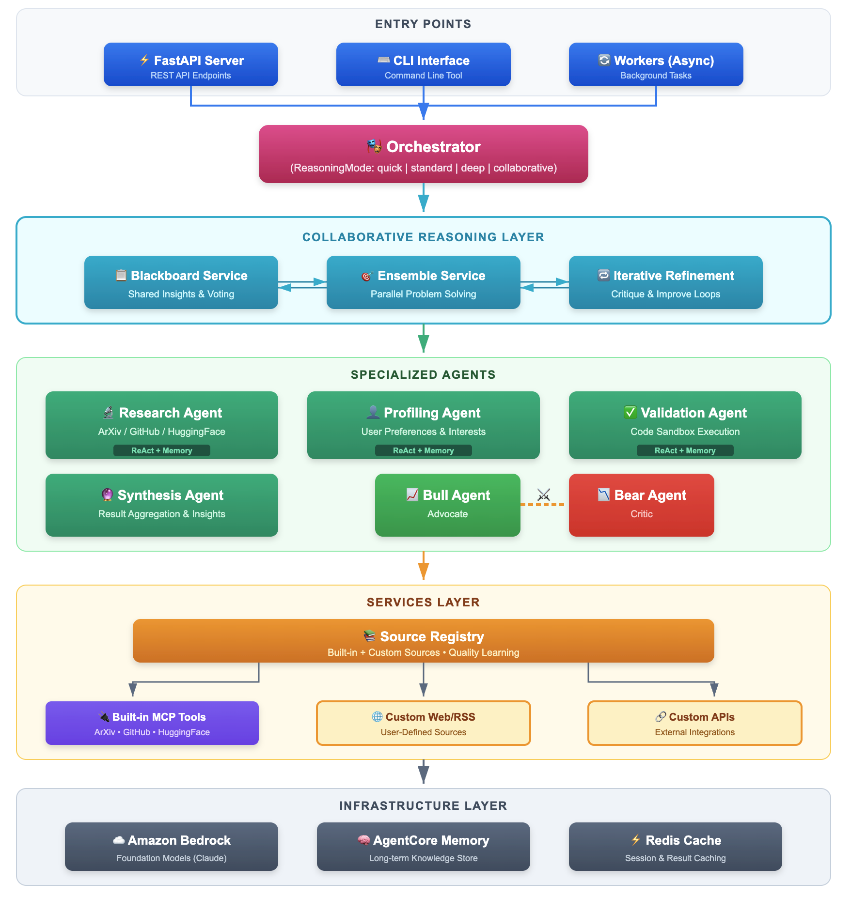

# DOVA - Deep Orchestrated Versatile Agent Platform

DOVA is an enterprise-grade, multi-agent research automation system built on AWS Strands Agents SDK and Amazon Bedrock AgentCore. It aggregates knowledge from ArXiv, GitHub, HuggingFace, and the web through the Model Context Protocol (MCP).

**Latest: v1.3** - Now with browser-based UI, answer synthesis, and confidence scoring!

## Features

### Core Capabilities
- **Browser-Based Research UI**: Modern dark-theme interface at `http://localhost:8081/`
- **Multi-Agent Architecture**: Specialized agents for research, profiling, validation, and synthesis
- **Agentic Reasoning**: ReAct-style reasoning loops, self-reflection, and working memory for smarter agents
- **Collaborative Intelligence**: Blackboard, ensemble, iterative refinement, and tool-augmented patterns for synergistic multi-agent reasoning (1+1>2)
- **Proactive Tool Discovery**: Automatic task analysis and tool selection from MCP servers, sandbox, and internal services
- **MCP Integration**: Unified protocol for ArXiv, GitHub, HuggingFace, and web search
- **Multi-Provider Web Search**: Brave, Perplexity, Tavily, and DuckDuckGo with auto-selection and fallback
- **Intelligent Source Selection**: Automatic source filtering based on query type (news vs technical)
- **Multi-Provider LLM**: AWS Bedrock, Anthropic, OpenAI with automatic fallback
- **Model Tiering**: Cost-optimized model selection (Basic/Standard/Advanced/Reasoning)

### Deep Research Intelligence (v1.3)
- **Answer Synthesis**: Direct LLM-synthesized answers to research queries (not just links)
- **Query Type Classification**: Automatic detection (technical, biographical, factual, general)
- **Smart Source Routing**: Biographical queries → web only; Technical queries → all sources
- **Confidence Scoring**: Answer quality assessment with 0-100% confidence scores
- **Iterative Query Refinement**: Automatic query improvement when confidence is low
- **Memory-Assisted Research**: Short-term (24h) and long-term (persistent) research memory

### Advanced Agent Intelligence (OpenClaw-Inspired)
- **Multi-Tiered Thinking**: Configurable thinking budgets (OFF→MINIMAL→LOW→MEDIUM→HIGH→XHIGH) with auto-selection based on task complexity
- **Self-Evaluation**: Response quality assessment with confidence scoring, format validation, and relevance checking
- **Intelligent Error Recovery**: Automatic error diagnosis (transient/configuration/capability) with recommended recovery actions
- **Session Management**: Automatic session freshness evaluation with staleness detection and recovery actions (continue/refresh/fork/repair)
- **Enhanced Memory**: Semantic search with MMR (Maximal Marginal Relevance) reranking for diverse, relevant results
- **Auto-Discovery**: Runtime discovery of available models and MCP servers with capability caching
- **Proactive Heartbeat**: Cron-based background tasks for health checks, cleanups, and periodic maintenance

### User & Content Features
- **Custom Sources**: User-defined research sources (Web URLs, RSS feeds, APIs) with quality learning
- **Proactive Recommendations**: Background monitoring of ArXiv/HuggingFace with personalized content delivery
- **User Profiling**: Personalized research recommendations with AgentCore Memory
- **Sandbox Execution**: Docker-based isolated code execution with resource tiers and quota management
- **Code Validation**: Static analysis and sandbox execution for validating research implementations
- **Bull/Bear Debate**: Balanced analysis through adversarial agent discussions
- **Background Jobs**: Redis Streams-based job queue with APScheduler for periodic tasks

## Quick Start

### Prerequisites

- Python 3.11+
- AWS Account with Bedrock access
- Docker (optional, for local development)

### Installation

```bash
# Clone the repository
git clone https://github.com/alfredcs/dova.git
cd dova

# Create virtual environment
python -m venv .venv
source .venv/bin/activate

# Install dependencies
pip install -e ".[dev]"

# Copy environment file
cp .env.example .env
# Edit .env with your configuration
```

### Configuration

Edit `.env` with your credentials:

```bash
# AWS Configuration
AWS_REGION=us-east-1
AWS_BEDROCK_MODEL_ID=anthropic.claude-sonnet-4-20250514-v1:0

# MCP Server Configuration
MCP_GITHUB_TOKEN=ghp_xxxxxxxxxxxx

# Web Search Providers (optional - DuckDuckGo is free fallback)
BRAVE_API_KEY=xxx           # https://brave.com/search/api/
PERPLEXITY_API_KEY=xxx      # https://perplexity.ai/settings/api
TAVILY_API_KEY=xxx          # https://tavily.com
```

### Running Locally

```bash
# Start Redis (required for caching)
docker-compose up -d redis

# Run the API server
make run-local

# Or use Docker Compose for everything
docker-compose up -d
```

### Browser-Based Research UI

```bash
# Start the server with UI
dova serve --port 8081

# Open in browser
open http://localhost:8081
```

The UI provides:
- Query input with source selection (ArXiv, GitHub, HuggingFace, Web)
- Direct synthesized answers with confidence scores
- Organized results by source type
- Real-time search progress indicators

### Using the CLI

```bash
# Interactive research query
dova research "latest advances in multi-agent LLM systems"

# Research with reasoning mode
dova research "compare transformer architectures" --reasoning deep

# Collaborative reasoning (multiple agents)
dova research "evaluate RAG vs fine-tuning" --reasoning collaborative

# Search ArXiv papers
dova search arxiv "transformer attention mechanisms"

# Search GitHub repositories
dova search github "rag implementation python"

# Research with web search for current events (works out of the box via DuckDuckGo)
dova research "latest AI developments" -s web -s arxiv

# View model tiering configuration
dova models

# Setup MCP server repos (clones arxiv-mcp-server etc.)
dova mcp setup

# Update MCP repos (git pull)
dova mcp update
```

### AWS Setup (Automated)

DOVA can automatically set up all required AWS services for AgentCore deployment:

```bash
# Run automated AWS setup (creates IAM, Cognito, SSM, Secrets Manager resources)
dova aws setup --stack-name my-dova-stack --region us-east-1

# Validate existing AWS setup
dova aws validate --stack-name my-dova-stack

# Show required IAM permissions
dova aws permissions

# Generate environment file from existing setup
dova aws env --stack-name my-dova-stack

# Remove all AWS resources (cleanup)
dova aws teardown --stack-name my-dova-stack
```

The setup command automatically creates:
- **IAM**: Execution role with Bedrock, AgentCore, SSM, and Secrets Manager policies
- **Cognito**: User Pool, Resource Server, App Client, and Domain for OAuth2
- **SSM Parameter Store**: Configuration parameters (Cognito provider, client ID)
- **Secrets Manager**: Client secret for OAuth2 authentication
- **Bedrock**: Validates model access (Claude 3 Sonnet/Haiku)

## Architecture



<details>
<summary>Text-based Architecture Diagram</summary>

```
┌─────────────────────────────────────────────────────────────────┐
│                         DOVA Platform                            │
├─────────────────────────────────────────────────────────────────┤
│                                                                  │
│  ┌─────────────────────────────────────────────────────────────┐│
│  │              INDIVIDUAL AGENT REASONING                      ││
│  │  ┌──────────┐  ┌──────────┐  ┌──────────┐  ┌──────────┐    ││
│  │  │  ReAct   │→ │  Self-   │→ │ Working  │→ │ Reasoning│    ││
│  │  │  Loop    │  │Reflection│  │ Memory   │  │  Trace   │    ││
│  │  └──────────┘  └──────────┘  └──────────┘  └──────────┘    ││
│  └─────────────────────────────────────────────────────────────┘│
│                                                                  │
│  ┌─────────────────────────────────────────────────────────────┐│
│  │              COLLABORATIVE REASONING                       ││
│  │  ┌──────────────┐  ┌──────────────┐  ┌──────────────┐      ││
│  │  │  BLACKBOARD  │  │   ENSEMBLE   │  │  ITERATIVE   │      ││
│  │  │Shared insight│  │Parallel solve│  │  Refinement  │      ││
│  │  └──────────────┘  └──────────────┘  └──────────────┘      ││
│  │  ┌──────────────────────────────────────────────────┐      ││
│  │  │           TOOL RESOLVER                          │      ││
│  │  │  Proactive tool discovery + task analysis        │      ││
│  │  └──────────────────────────────────────────────────┘      ││
│  └─────────────────────────────────────────────────────────────┘│
│                                                                  │
│  ┌─────────────┐  ┌─────────────┐  ┌─────────────┐              │
│  │ Orchestrator│  │  Research   │  │  Profiling  │              │
│  │    Agent    │  │    Agent    │  │    Agent    │              │
│  └─────────────┘  └─────────────┘  └─────────────┘              │
│         │                │                │                      │
│         └────────────────┼────────────────┘                      │
│                          │                                       │
│              ┌───────────┴───────────┐                           │
│              │    Source Registry    │                           │
│              │    (Quality Learning) │                           │
│              └───────────┬───────────┘                           │
│         ┌────────────────┼────────────────┐                      │
│         │                │                │                      │
│  ┌──────┴──────┐  ┌──────┴──────┐  ┌──────┴──────┐              │
│  │  Built-in   │  │   Custom    │  │   Custom    │              │
│  │  (MCP)      │  │  Web/RSS    │  │    APIs     │              │
│  └──────┬──────┘  └─────────────┘  └─────────────┘              │
│         │                                                        │
│  ┌──────┴──────┬──────────────┬──────────────┐                  │
│  │   ArXiv     │   GitHub     │ HuggingFace  │                  │
│  └─────────────┴──────────────┴──────────────┘                  │
└─────────────────────────────────────────────────────────────────┘
```

</details>

## Project Structure

```
DOVA/
├── src/dova/
│   ├── agents/          # Agent implementations
│   │   ├── base.py      # Base agent class with ReasoningMixin
│   │   ├── orchestrator.py  # Master orchestrator with ReasoningMode
│   │   ├── mixins/      # Agent capability mixins
│   │   │   ├── memory.py    # Memory capabilities
│   │   │   └── reasoning.py # ReAct, reflection, scratchpad
│   │   ├── research.py
│   │   ├── profiling.py
│   │   ├── validation.py
│   │   ├── synthesis.py
│   │   └── debate.py
│   ├── jobs/            # Background job infrastructure
│   │   ├── jobs.py      # Job dataclass and types
│   │   ├── streams.py   # Redis Streams job queue
│   │   ├── scheduler.py # APScheduler for periodic jobs
│   │   ├── worker.py    # Background job processor
│   │   └── heartbeat.py # Cron-based proactive task system
│   ├── services/        # Core services
│   │   ├── blackboard.py    # Shared workspace for collaborative reasoning
│   │   ├── ensemble.py      # Ensemble reasoning with aggregation strategies
│   │   ├── collaborative.py # Unified collaborative reasoning orchestrator
│   │   ├── tool_resolver.py # Proactive tool discovery and selection
│   │   ├── sources.py       # Source registry and fetcher
│   │   ├── memory.py        # AgentCore memory integration
│   │   ├── thinking.py      # Multi-tiered thinking level system
│   │   ├── evaluation.py    # Self-evaluation and error diagnosis
│   │   ├── session.py       # Session freshness and state management
│   │   ├── memory_enhanced.py # Semantic search with MMR reranking
│   │   ├── discovery.py     # Model and MCP auto-discovery
│   │   ├── recommendation/  # Proactive recommendation services
│   │   │   ├── monitors.py      # ArXiv/HuggingFace polling
│   │   │   ├── processor.py     # Content normalization & embedding
│   │   │   ├── matcher.py       # User-content matching
│   │   │   ├── delivery.py      # Notification batching & capping
│   │   │   └── subscriptions.py # Subscription management
│   │   └── sandbox/         # Code execution sandbox
│   │       ├── types.py     # Tier definitions and job types
│   │       ├── quota.py     # User quota management
│   │       ├── scheduler.py # Tier inference from code
│   │       └── executor.py  # Docker-based execution
│   ├── tools/           # Custom tools and MCP registry
│   ├── api/             # FastAPI application
│   ├── config/          # Configuration and settings
│   └── utils/           # Utilities (logging, caching, metrics)
├── infra/               # AWS CDK infrastructure
├── tests/               # Test suite
├── scripts/             # Utility scripts
└── docs/                # Documentation
```

## API Endpoints

| Endpoint | Method | Description |
|----------|--------|-------------|
| `/health` | GET | Health check |
| `/api/v1/research` | POST | Execute research query |
| `/api/v1/search/{source}` | POST | Search specific source (arxiv, github, huggingface) |
| `/api/v1/profile` | GET/PUT | Get/update user profile |
| `/api/v1/validate` | POST | Validate code (static analysis) |
| `/api/v1/validate/execute` | POST | Execute code in sandbox |
| `/api/v1/validate/quota` | GET | Get remaining execution quota |
| `/api/v1/sources` | GET/POST | List or add custom sources |
| `/api/v1/sources/{id}` | PUT/DELETE | Update or delete a custom source |
| `/api/v1/sources/interact` | POST | Record interaction for quality learning |
| `/api/v1/subscriptions` | GET/POST | List or create content subscriptions |
| `/api/v1/subscriptions/{id}` | GET/PATCH/DELETE | Get, update, or delete subscription |
| `/api/v1/subscriptions/recommendations` | GET | Get personalized recommendations |
| `/api/v1/subscriptions/preferences` | GET/PATCH | Get/update delivery preferences |
| `/api/v1/webhooks/github` | POST | Receive GitHub webhook events |

### Reasoning Modes

The `/api/v1/research` endpoint supports different reasoning depth levels via the `reasoning_mode` parameter:

| Mode | Description |
|------|-------------|
| `quick` | Single-pass, no reflection - fastest response |
| `standard` | ReAct + self-reflection - balanced depth |
| `deep` | Full ensemble reasoning - multiple agents solve in parallel |
| `collaborative` | Hybrid mode - blackboard + ensemble + iterative refinement |
| `tool_augmented` | Proactive tool discovery and execution before agent reasoning |

```bash
# Example: Deep reasoning query
curl -X POST http://localhost:8000/api/v1/research \
  -H "Content-Type: application/json" \
  -d '{"query": "compare transformer architectures", "reasoning_mode": "deep"}'
```

## Development

```bash
# Run tests
make test

# Run linting
make lint

# Format code
make format

# Type checking
make typecheck

# Run all checks
make check
```

## Deployment

### AWS CDK Deployment

```bash
# Install CDK dependencies
make cdk-install

# Deploy to AWS
make deploy
```

### Environment Variables

| Variable | Description | Required |
|----------|-------------|----------|
| `AWS_REGION` | AWS region for Bedrock | Yes |
| `AWS_BEDROCK_MODEL_ID` | Bedrock model ID | Yes |
| `STACK_NAME` | AWS stack name for AgentCore resources | For AgentCore |
| `MEMORY_ID` | AgentCore Memory ID | For AgentCore |
| `GATEWAY_URL` | AgentCore Gateway URL | For AgentCore |
| `MCP_GITHUB_TOKEN` | GitHub personal access token | No |
| `BRAVE_API_KEY` | Brave Search API key | No |
| `PERPLEXITY_API_KEY` | Perplexity API key | No |
| `TAVILY_API_KEY` | Tavily API key for web search | No |
| `REDIS_HOST` | Redis host | Yes |
| `REDIS_PORT` | Redis port | Yes |
| `JOB_WORKER_CONCURRENCY` | Background worker concurrency | No (default: 5) |
| `JOB_ARXIV_POLL_HOURS` | ArXiv polling interval in hours | No (default: 1.0) |
| `JOB_HF_POLL_HOURS` | HuggingFace polling interval | No (default: 6.0) |
| `SANDBOX_ENABLED` | Enable sandbox execution | No (default: false) |
| `SANDBOX_DOCKER_HOST` | Docker socket path | No |
| `SANDBOX_MAX_CONCURRENT` | Max concurrent sandbox executions | No (default: 5) |
| `THINKING_DEFAULT_LEVEL` | Default thinking level (off/minimal/low/medium/high/xhigh) | No (default: medium) |
| `THINKING_AUTO_SELECT_ENABLED` | Auto-select thinking level based on task | No (default: true) |
| `HEARTBEAT_ENABLED` | Enable proactive heartbeat tasks | No (default: true) |
| `EVAL_AUTO_EVALUATE_RESPONSES` | Auto-evaluate LLM responses | No (default: false) |
| `EVAL_MIN_CONFIDENCE_THRESHOLD` | Minimum confidence threshold (0-1) | No (default: 0.6) |
| `SESSION_STALE_AFTER_SECONDS` | Session staleness timeout | No (default: 1800) |
| `SESSION_EXPIRE_AFTER_SECONDS` | Session expiry timeout | No (default: 86400) |
| `DISCOVERY_AUTO_DISCOVER_ON_STARTUP` | Auto-discover models on startup | No (default: true) |
| `MEMORY_ENHANCED_SEMANTIC_SEARCH_ENABLED` | Enable semantic memory search | No (default: true) |
| `MEMORY_ENHANCED_MMR_LAMBDA` | MMR diversity parameter (0-1) | No (default: 0.5) |
| `LLM_TIER_BASIC_MODEL` | Model for basic tasks (classification, summarization) | No |
| `LLM_TIER_STANDARD_MODEL` | Model for standard tasks | No |
| `LLM_TIER_ADVANCED_MODEL` | Model for complex tasks (code generation, reasoning) | No |
| `LLM_TIER_REASONING_MODEL` | Model for deep reasoning tasks | No |

## License

Apache 2.0
